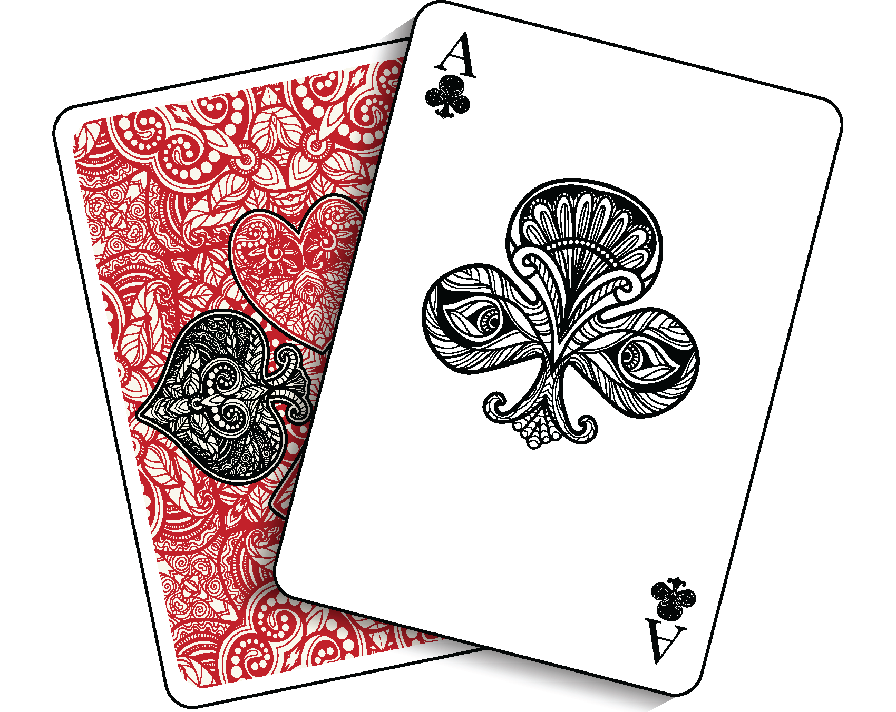

<!-- PROJECT SHIELDS -->
[![Contributors][contributors-shield]][contributors-url]
[![Forks][forks-shield]][forks-url]
[![Stargazers][stars-shield]][stars-url]
[![Issues][issues-shield]][issues-url]
[![MIT License][license-shield]][license-url]
[![LinkedIn][linkedin-shield]][linkedin-url]

<!-- PROJECT LOGO -->
 

  

<h3 align="center">Floating Bridge Game App</h3>

  

    The first ever online floating bridge game!
     
    <a href="https://game.floatingbridge.me">View Demo</a>
    ·
    <a href="https://github.com/thespacemanatee/Floating-Bridge-Game-App/issues">Report Bug</a>
    ·
    <a href="https://github.com/thespacemanatee/Floating-Bridge-Game-App/issues">Request Feature</a>
  

<!-- ABOUT THE PROJECT -->

## About The Project

[![Product Name Screen Shot][product-screenshot]](https://example.com)

(<a href="#top">back to top</a>)

## Game Rules

http://gambiter.com/bridge/Singaporean_bridge.html

## Demo

https://game.floatingbridge.me/

## Tech Stack

## Contributing

Contributions are always welcome!

See `contributing.md` for ways to get started.

Please adhere to this project's `code of conduct`.

<!-- MARKDOWN LINKS & IMAGES -->
<!-- https://www.markdownguide.org/basic-syntax/#reference-style-links -->

[contributors-shield]: https://img.shields.io/github/contributors/thespacemanatee/Floating-Bridge-Game-App?style=for-the-badge

[contributors-url]: https://github.com/thespacemanatee/Floating-Bridge-Game-App/graphs/contributors

[forks-shield]: https://img.shields.io/github/forks/thespacemanatee/Floating-Bridge-Game-App?style=for-the-badge

[forks-url]: https://github.com/thespacemanatee/Floating-Bridge-Game-App/network/members

[stars-shield]: https://img.shields.io/github/stars/thespacemanatee/Floating-Bridge-Game-App?style=for-the-badge

[stars-url]: https://github.com/thespacemanatee/Floating-Bridge-Game-App/stargazers

[issues-shield]: https://img.shields.io/github/issues/thespacemanatee/Floating-Bridge-Game-App?style=for-the-badge

[issues-url]: https://github.com/thespacemanatee/Floating-Bridge-Game-App/issues

[license-shield]: https://img.shields.io/github/license/thespacemanatee/Floating-Bridge-Game-App?style=for-the-badge

[license-url]: https://github.com/thespacemanatee/Floating-Bridge-Game-App/blob/master/LICENSE.txt

[linkedin-shield]: https://img.shields.io/badge/-LinkedIn-black.svg?style=for-the-badge&logo=linkedin&colorB=555

[linkedin-url]: https://linkedin.com/in/chee-kit

[product-screenshot]: https://media.giphy.com/media/fzEUiJb6PZW8AB6URf/giphy-downsized-large.gif
